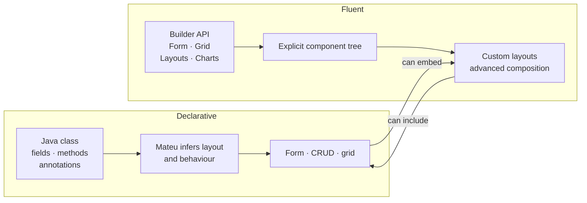

# Declarative vs fluent

Mateu supports two main ways of building UIs in Java.

## Declarative

In the declarative style, you describe the UI with:

- classes
- fields
- methods
- annotations

### Best for

- forms
- CRUD screens
- fast development
- simple UIs

## Fluent

In the fluent style, you build the UI with Mateu's Java API.

### Best for

- custom layouts
- advanced composition
- fine-grained control

## Recommendation

Start with the declarative style.

Use the fluent style when you need more control.

