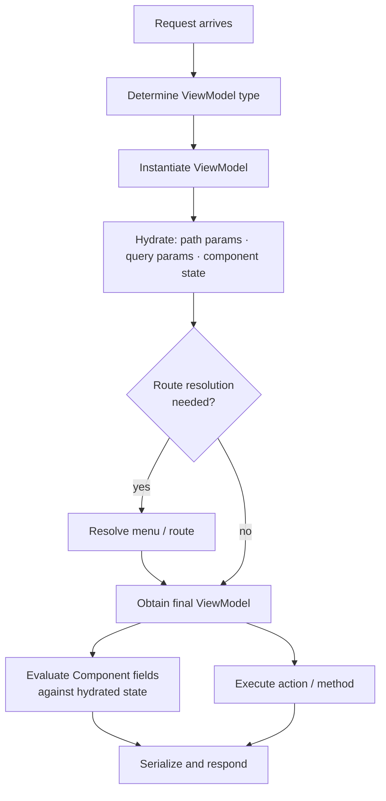

# ViewModel lifecycle

For each request, Mateu follows this lifecycle:

1. determine the target ViewModel type
2. instantiate and hydrate the ViewModel
3. resolve menu / route if needed
4. obtain the final ViewModel
5. execute the requested method or action
6. serialize the result and send it to the frontend

## Practical implications

### Hydration first

Route parameters and query parameters are injected before any UI logic is evaluated.

### Fluent components

Fields of type `Component` are evaluated against the already hydrated ViewModel.

Fields of type `Callable<?>` are also evaluated after hydration, which makes them suitable for dynamic UI.

### Actions

Actions can:

- mutate the ViewModel state
- return UI effects such as `Message` or `UICommand`

Both things happen in the same request.

👉 See [Execution model →](/java-user-manual/concepts/execution-model/)
