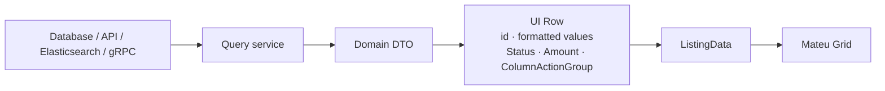

# Query services and UI rows

Mateu works with explicitly designed UI rows, not domain entities. This separation keeps your domain clean and gives you full control over what users see.

---

## The core idea



Listing rows are records designed for display:

```java
record OrderRow(
        String id,
        String customerName,
        LocalDate date,
        Amount total,
        Status status,
        ColumnActionGroup actions
) {}
```

These are not JPA entities. They are DTOs built from query results, with:
- Formatted or derived values (`customerName` instead of `customerId`)
- UI-specific types (`Status`, `Amount`, `ColumnActionGroup`)
- No persistence annotations

---

## Building rows from a query service

```java
@Override
public ListingData<OrderRow> search(
        String searchText, OrderFilters filters, Pageable pageable, HttpRequest httpRequest) {

    var dtos = orderQueryService.search(
            searchText, filters.status(), pageable.page(), pageable.size());

    var rows = dtos.stream()
            .map(dto -> new OrderRow(
                    dto.id(),
                    dto.customerName(),
                    dto.date(),
                    new Amount("EUR", dto.totalCents() / 100.0),
                    new Status(mapStatus(dto.status()), dto.status().label()),
                    new ColumnActionGroup(new ColumnAction[] {
                            new ColumnAction("view", "View", IconKey.Eye.iconName),
                            new ColumnAction("delete", "Delete", IconKey.Trash.iconName)
                    })
            ))
            .toList();

    return new ListingData<>(new Page<>(
            searchText,
            pageable.size(),
            pageable.page(),
            dtos.totalCount(),
            rows
    ), "No orders found.");
}
```

The query service returns domain DTOs. The listing class maps them to UI rows.

---

## Status mapping

```java
private StatusType mapStatus(OrderStatus status) {
    return switch (status) {
        case CONFIRMED  -> StatusType.SUCCESS;
        case PENDING    -> StatusType.WARNING;
        case CANCELLED  -> StatusType.DANGER;
        default         -> StatusType.NONE;
    };
}
```

---

## Why not use entities directly

| Approach | Problem |
|---|---|
| Expose entity directly | Domain leaks into UI; any field change breaks the UI |
| Use entity as row record | JPA annotations, lazy-loaded relations, and heavy objects in the listing |
| Query service + UI row | Query-optimized, UI-optimized, no coupling |

The query service can be a JPQL projection, an Elasticsearch query, a remote REST call, or any other source. The listing doesn't care.

---

## Per-row dynamic actions

Row actions can vary per row — different users or states get different options:

```java
var actions = switch (dto.status()) {
    case PENDING   -> new ColumnActionGroup(new ColumnAction[]{
            new ColumnAction("confirm", "Confirm", IconKey.Check.iconName),
            new ColumnAction("cancel",  "Cancel",  IconKey.Close.iconName)
    });
    case CONFIRMED -> new ColumnActionGroup(new ColumnAction[]{
            new ColumnAction("ship", "Ship", IconKey.Package.iconName)
    });
    default        -> new ColumnActionGroup(new ColumnAction[]{});
};
```

---

## Next

- [Lookups backed by query services](/java-user-manual/real-world/lookups-backed-by-query-services/)
- [Listings](/java-user-manual/concepts/fluent-components/fluent-listings/)
- [Display components](/java-user-manual/concepts/fluent-components/fluent-display-components/)
