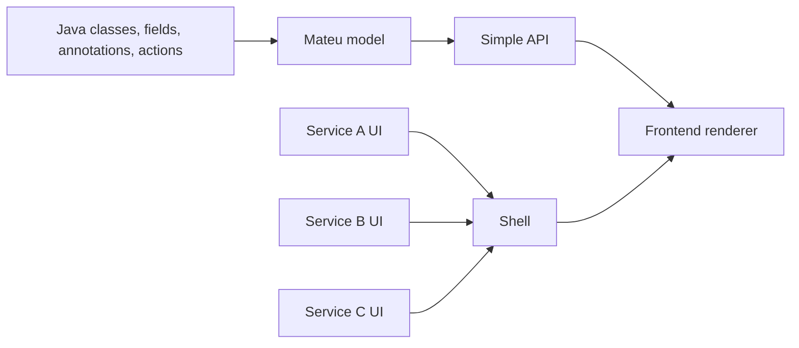

# Architecture diagram

This is the shortest way to understand Mateu.

## Read it like this

- your backend code defines the UI model
- Mateu exposes that model through a simple API
- a renderer turns it into a real UI
- multiple services can contribute UI modules to one shell

## Why it matters

This is why Mateu fits so naturally with:

- microservices
- distributed systems
- stateless architectures
- internal tools and business apps
