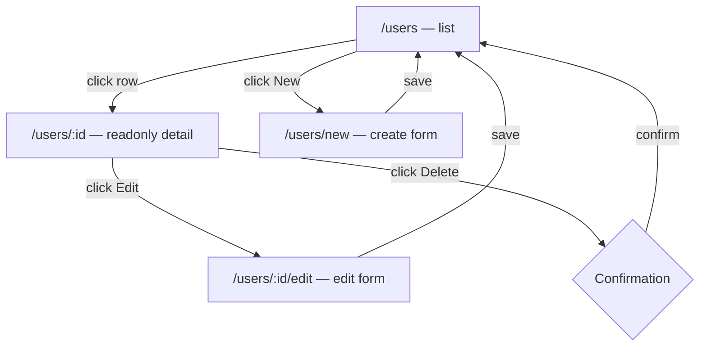

When you use `AutoCrud`, Mateu generates a complete navigation flow around your resource — not just a table.

---

## Default routes

For a CRUD published at `/users`:

```java
@Service
@UI("/users")
public class UsersPage extends AutoCrud<User> {

    final UserStore userStore;

    public UsersPage(UserStore userStore) {
        this.userStore = userStore;
    }

    @Override
    public CrudStore<User> store() {
        return userStore;
    }
}
```

Mateu generates these routes automatically:

| Route | Purpose |
|---|---|
| `/users` | List |
| `/users/new` | Create form |
| `/users/:id` | Readonly detail view |
| `/users/:id/edit` | Edit form |

---

## The default navigation path

The default action in the listing is **View** (read-only), not Edit.

The standard flow is:



This is intentional: the read-only view serves as a safe preview before the user commits to editing.

---

## Binding a custom editor page

You can replace the auto-generated edit form with a custom page using `@Route` and the `uis` parameter.

```java
@Service
@Route(value = "/:id/edit", uis = {"/users"})
@Style(StyleConstants.CONTAINER)
@FormLayout(columns = 1)
public class UserEditorPage {

    final UserStore userStore;

    public UserEditorPage(UserStore userStore) {
        this.userStore = userStore;
    }

    String id;

    @NotEmpty
    String name;

    @NotEmpty
    @Email
    String email;

    @Lookup(search = RoleOptionsSupplier.class, label = RoleLabelSupplier.class)
    @Stereotype(FieldStereotype.checkbox)
    List<String> roles;

    @Button
    Object save() {
        userStore.save(new User(id, name, email, roles));
        return List.of(
                new Message("User saved"),
                new State(this)
        );
    }
}
```

Key points:

- `value = "/:id/edit"` defines the sub-route pattern
- `uis = {"/users"}` tells Mateu that this page is the edit form for the `/users` CRUD
- The `:id` parameter is populated automatically from the URL
- The page replaces the auto-generated edit form; everything else in the CRUD flow stays the same

---

## How the id parameter is populated

Mateu reads URL parameters and maps them to fields with matching names.

If the route is `/:id/edit` and the page has a field `String id`, Mateu sets it automatically before the page is displayed.

This works for any parameter name:

```java
@Route("/example/:name")
public class ExampleParametersViewModel {

    String name;       // populated from :name
    int version;

    @ReadOnly
    String assessment;

    @Button
    void check() {
        assessment = "name= " + name + ", version=" + version;
    }
}
```

---

## What the auto-generated forms look like

Without a custom editor, Mateu auto-generates the edit and create forms from the model:

- all fields become form inputs
- `@NotEmpty` / `@NotNull` generate validation
- `@HiddenInList` fields appear in the form but not in the list
- `@EditableOnlyWhenCreating` fields are editable in the create form but read-only in the edit form
- `@ReadOnly` fields are always read-only

---

## Customizing only some parts

You can replace only the editor while keeping the auto-generated list, detail view, and create form. Or vice versa.

Use `@Route(value = "...", uis = {"/route"})` to bind any custom page into the CRUD flow.

---

## Read-only variant: AutoCrud + @ReadOnly

If you only need list + detail view (no editing or creating), annotate `AutoCrud` with `@ReadOnly`:

```java
@Service
@UI("/products")
@ReadOnly
public class ProductsPage extends AutoCrud<Product> {

    final ProductStore productRepository;

    public ProductsPage(ProductStore productRepository) {
        this.productRepository = productRepository;
    }

    @Override
    public CrudStore<Product> store() {
        return productRepository;
    }
}
```

Routes generated:

| Route | Purpose |
|---|---|
| `/products` | List (no New / Delete buttons) |
| `/products/:id` | Readonly detail view (no Edit button) |

Add `@NotNavigable` to remove the View button too, for a plain flat list with no detail screen.

---

## Mental model

- `AutoCrud` generates the full flow: list, view, edit, create
- `AutoCrud + @ReadOnly` generates a read-only subset: list + view only
- Default navigation goes: list → readonly detail → edit (not directly to edit)
- Custom pages bind into the flow with `@Route(uis = "/route")`
- URL parameters are mapped to same-named fields automatically
- You can replace any part of the flow while keeping the rest auto-generated

---

## Next

- [Customizing CRUD and listings](/java-user-manual/build/customizing-crud-and-listings/) — annotations, layout, and actions for refining the default CRUD
- [Listing row actions](/java-user-manual/build/listing-row-actions/) — per-row `ColumnAction` and `ColumnActionGroup`
- [Full control with Crud](/java-user-manual/build/full-control-crud-orchestrator/) — explicit control over filters, rows, views, and forms
