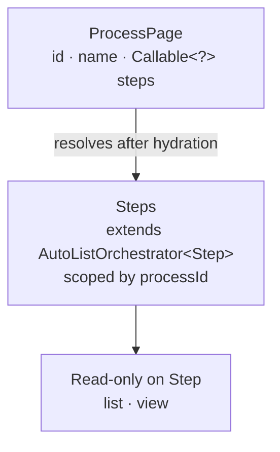

A master-detail UI in Mateu is built by embedding a child CRUD orchestrator inside a parent screen, not by using `List<Entity>`.

The pattern applies to any parent-child relationship: Order + OrderLines, Customer + Contacts, Project + Tasks. This page uses a Process + Steps example to show the mechanics clearly. The [golden example](/java-user-manual/build/orders-customers-order-lines/) applies the same pattern to Orders and OrderLines with a full backend stack.

---

## Goal

We want:

- a Process (parent)
- a list of Steps (children)
- full CRUD on Steps inside the Process screen

---

## Process (parent)

```java
@Route("/processes/:id")
@Style(StyleConstants.CONTAINER)
public class ProcessPage {

    String id;

    String name;

    Callable<?> steps = () -> MateuBeanProvider
        .getBean(Steps.class)
        .withProcessId(id);

}
```

### Key idea

- `steps` is NOT `List<Step>`
- it is a dynamic UI block
- resolved after the viewmodel is hydrated

---

## Steps (child CRUD)

```java
public class Steps extends AutoListOrchestrator<Step> {

    String processId;

    public Steps withProcessId(String processId) {
        this.processId = processId;
        return this;
    }

}
```

---

## Step model

```java
record Step(
    String id,
    String processId,
    String name
) {}
```

---

## What Mateu generates

Inside the Process screen:

- list of steps (scoped by `processId`)
- readonly detail view per step

If you need create/edit/delete on the child, extend `AutoCrudOrchestrator` instead.

---

## Why this approach

This is preferred over:

```java
List<Step> steps;
```

Because:

- `List<Step>` becomes a simple editable structure
- it does NOT provide full CRUD behavior
- it couples UI to domain structure

---

## Mental model



- parent → state + composition
- child → independent CRUD
- composition → `Callable<?>`

---

## When to use

Use this pattern when:

- child entities have their own lifecycle
- you need CRUD inside another screen
- you want explicit control over data boundaries

---

## Summary

- do NOT model child collections as `List<Entity>`
- use embedded orchestrators instead
- compose using `Callable<?>`

This is the Mateu way to build master-detail UIs.

---

## Next

- [Relationships vs embedded CRUDs](/java-user-manual/build/relationships-vs-embedded-cruds/) — when to use `@Lookup`, `List<Entity>`, or an embedded orchestrator
- [Golden example: Orders, Customers and Order lines](/java-user-manual/build/orders-customers-order-lines/) — the same pattern applied with a full adapter and repository stack
