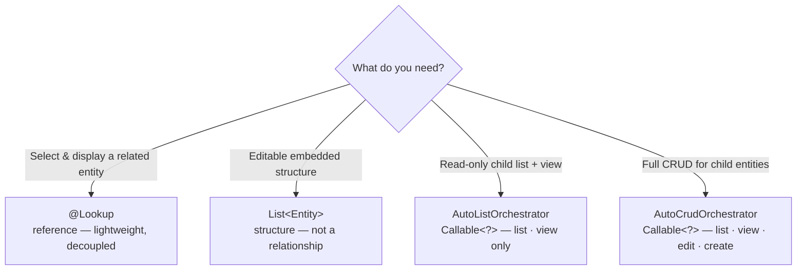

Mateu intentionally distinguishes between:

- lightweight relationships rendered through `@Lookup`
- embedded child CRUDs rendered through orchestrators

---

## Use `@Lookup` when

Use `@Lookup` when:

- the field stores ids or scalar references
- the UI only needs selection + label resolution
- the relationship should stay decoupled from the domain model

Example:

```java
@Lookup(search = RoleOptionsSupplier.class, label = RoleLabelSupplier.class)
List<String> roles;
```

Mateu will automatically generate:

- selection UI (checkbox, dropdown, etc.)
- label resolution
- integration with forms and CRUD

---

## Do NOT use `List<Entity>` for lookups

If you declare:

```java
List<Role> roles;
```

Mateu will infer an editable structure (like a table).

This is NOT treated as a relationship with repository-backed lookup.

This is intentional.

Mateu avoids leaking domain behavior into the UI layer.

---

## Use embedded CRUDs instead

If the child collection has its own lifecycle, use an embedded CRUD.

Example:

```java
Callable<?> steps = () -> MateuBeanProvider.getBean(Steps.class).withProcessId(id);
```

Where:

```java
public class Steps extends AutoListOrchestrator<Step> { ... }
```

This gives you:

- list + readonly detail view (no edit or create)
- independent lifecycle
- master-detail UI

For full CRUD on the child (create/edit/delete), use `AutoCrudOrchestrator` instead.

---

## Mental model



- `@Lookup` → reference (lightweight, decoupled)
- `List<Entity>` → structure (not a relationship)
- embedded orchestrator → real child aggregate UI

---

## Why this matters

This prevents:

- accidental coupling between UI and domain
- implicit ORM-like behavior
- hidden data loading

Instead, everything is explicit and composable.

---

## Next

- [Master-detail](/java-user-manual/build/master-detail/) — step-by-step example of an embedded child CRUD with `Callable<?>`
- [Foreign keys and options](/java-user-manual/build/foreign-keys-and-options/) — how `@Lookup` works with options suppliers and label resolution
- [Golden example: Orders, Customers and Order lines](/java-user-manual/build/orders-customers-order-lines/) — all three patterns in a single realistic business UI
