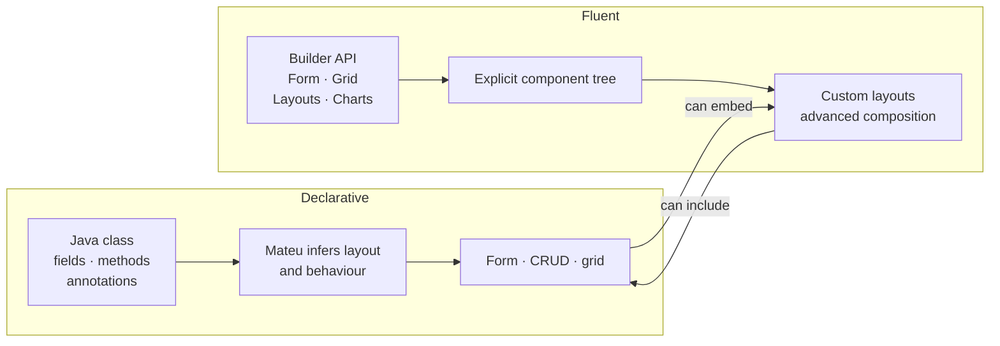

Mateu supports two ways of building UIs. The declarative style uses Java classes and annotations. The fluent style uses a builder API. Both can be combined.

---

## Declarative

In the declarative style, the framework infers the UI from your class structure.

```java
@UI("/products/new")
public class NewProductForm {

    @NotBlank
    String name;

    @Stereotype(FieldStereotype.radio)
    Status status = Status.Available;

    @Stereotype(FieldStereotype.textarea)
    String description;

    @Button
    @Action(validationRequired = true)
    public Message save() {
        productRepository.save(name, status, description);
        return new Message("Product saved");
    }

}
```

Mateu generates the form layout, field controls, and action buttons from the class. No layout code needed.

### Best for

- Forms and CRUD screens
- Standard admin UIs
- Fast development
- Cases where the domain model maps cleanly to the UI

---

## Fluent

In the fluent style, you build the UI explicitly using Mateu's builder API.

```java
@UI("/dashboard")
public class Dashboard implements Component {

    @Override
    public Component content() {
        return Grid.of(
            Row.of(
                Card.of("Total products", productRepository.count()),
                Card.of("Available", productRepository.countByStatus(Status.Available)),
                Card.of("Out of stock", productRepository.countByStatus(Status.OutOfStock))
            ),
            Row.of(
                Chart.bar("Stock by category", stockService.byCategory())
            )
        );
    }

}
```

You control exactly what is rendered and how it is composed.

### Best for

- Custom dashboards and layouts
- Widgets and data visualizations
- Screens that cannot be expressed with field annotations
- Advanced composition of multiple data sources

---

## Mixing both styles

Declarative and fluent components can be embedded in each other.

A declarative ViewModel can include a `Component` field that is built with the fluent API:

```java
public class ProductForm {

    String name;
    Status status;

    Component stockChart = Chart.line("Stock history", stockService.history(id));

}
```

A fluent layout can embed a declarative ViewModel as a sub-component.

---

## Which to use



Start with the declarative style. Use the fluent style when you need explicit layout control or when the UI cannot be expressed with annotations alone.

---

## Next

- [State, actions and fields](/java-user-manual/concepts/state-actions-and-fields/)
- [Field stereotypes](/java-user-manual/concepts/field-stereotypes/)
- [Action behavior](/java-user-manual/concepts/action-behavior/)
