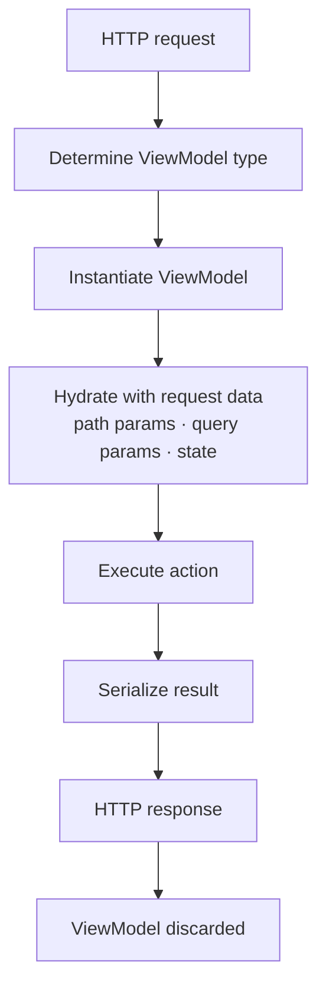

Mateu follows a fully stateless execution model. Every request is self-contained and reproducible.

## Lifecycle per request

For each request:

1. Determine the ViewModel type from the route
2. Instantiate the ViewModel
3. Hydrate it with path parameters, query parameters, and form state sent by the browser
4. Execute the requested action (if any)
5. Serialize the result
6. Return the HTTP response
7. Discard the ViewModel



## No server-side state

There is no persistent UI state between requests.

The browser holds the form state. On each interaction, it sends the current state to the server. The server hydrates a fresh ViewModel with that state, runs the action, and returns the result.

This means:

- you cannot store UI state in instance fields across requests
- there are no sessions to replicate
- any two server instances produce identical results for the same request

## What this enables

- Horizontal scalability with no constraints — any instance can handle any request
- No session management or replication infrastructure
- Resilience to restarts and pod replacements
- Consistent behavior across environments (local, staging, production)

## Spring beans and services

ViewModels are instantiated by Mateu, not by Spring, but they can still inject services:

```java
@UI("/products/new")
public class NewProductForm {

    @Autowired
    ProductRepository productRepository;

    @NotBlank
    String name;

    @Button
    public Message save() {
        productRepository.save(name);
        return new Message("Saved");
    }

}
```

Because the ViewModel is discarded after each response, injected beans are only used within that single request.

## Mental model

Think of Mateu as:

> UI = pure function (request state → response)

No hidden lifecycle. No long-lived server objects. No shared mutable state.

---

## Next

- [ViewModel lifecycle](/java-user-manual/concepts/viewmodel-lifecycle/)
- [State, actions and fields](/java-user-manual/concepts/state-actions-and-fields/)
- [Routing and parameters](/java-user-manual/concepts/routing-and-parameters/)
