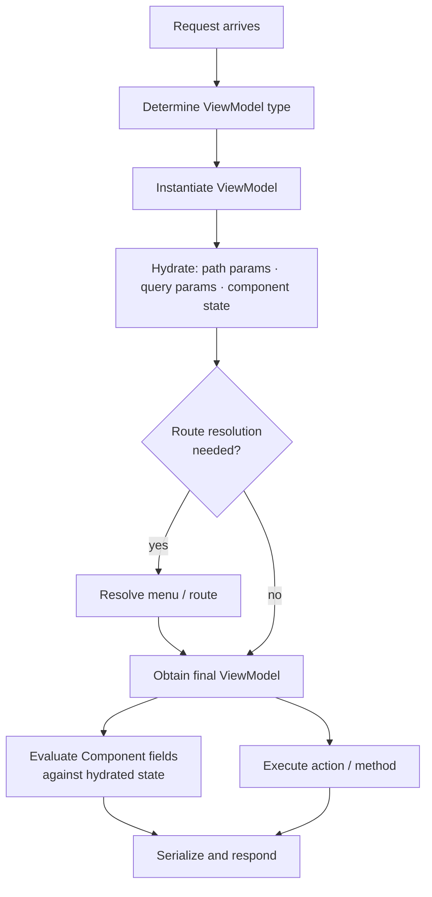

For each request, Mateu creates a fresh ViewModel, hydrates it, and either renders the UI or executes an action — then discards the object.

## Steps

1. Determine the target ViewModel type from the route
2. Instantiate the ViewModel
3. Hydrate: inject path parameters, query parameters, and the component state sent by the browser
4. Resolve menu or route if needed (for orchestrators)
5. Obtain the final ViewModel (may differ from the root after route resolution)
6. Evaluate `Component` and `Callable<?>` fields against the hydrated state
7. Execute the requested action, if any
8. Serialize the result and send it to the frontend



## Practical implications

### Hydration first

Route parameters and query parameters are injected before any UI logic is evaluated. When your action runs, the ViewModel already holds the correct field values from the URL and the browser state.

```java
@Route("/products/:id")
public class ProductForm {

    String id;   // already populated when save() runs

    @Button
    public Message save() {
        productRepository.save(id, name, status);
        return new Message("Saved");
    }

}
```

### Fluent components

Fields of type `Component` and `Callable<?>` are evaluated after hydration. This makes them suitable for dynamic UI that depends on the current state.

```java
Callable<String> summary = () -> name + " — " + status;
```

The lambda runs against the already-hydrated ViewModel, so `name` and `status` reflect the values from the current request.

### Actions

Actions can:

- mutate ViewModel fields
- return UI effects such as `Message`, `State`, `URI`, or `UICommand`

Both happen in the same request. If you mutate a field and also return `State(this)`, the browser receives the updated form in the same response.

---

## Next

- [Execution model](/java-user-manual/concepts/execution-model/)
- [State, actions and fields](/java-user-manual/concepts/state-actions-and-fields/)
- [UI effects](/java-user-manual/concepts/ui-effects/)
