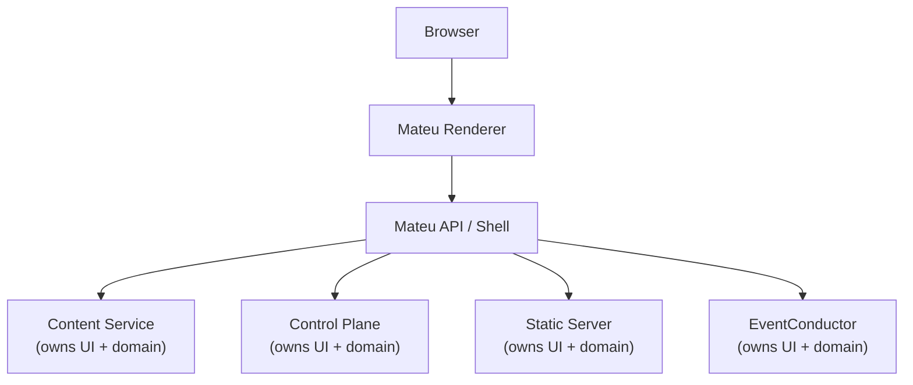

This case study shows Mateu used across multiple microservices, each owning its own UI, with a shell that federates them into a single backoffice. It illustrates the most common real-world patterns together.

---

## Architecture



Each service owns its domain and its UI. The shell owns nothing except the composition.

---

## Service-owned UI

Each service exposes its own `@UI`:

```java
@UI("/_content-service")
public class ContentServiceHome {}
```

Each module defines its own menu, routes, and orchestrators. No shared frontend repository is needed.

The shell aggregates them using `RemoteMenu`:

```
Shell
  ├── Content Service UI
  ├── Control Plane UI
  └── Other modules
```

See [Service-owned UI modules](/java-user-manual/real-world/service-owned-ui-modules/) for the full pattern.

---

## DTO to row to UI

Query results flow through a mapping step before reaching the grid:

```java
new ChangeRow(
    dto.pageId(),
    dto.page(),
    dto.country(),
    dto.language(),
    new Status(...),
    new ColumnAction("compare", "Compare")
)
```

```
DTO → Row → Component → UI
```

The row is a UI read model — a record designed for display, not for the domain. See [Query services and UI rows](/java-user-manual/real-world/query-services-and-ui-rows/).

---

## Actions as contracts

The action id is the only contract between the UI and the backend:

```java
new ColumnAction("compare", "Compare")
```

```
User click → actionId → backend → use case
```

No logic lives in the frontend. The backend decides what "compare" means.

---

## Lookups across services

Lookup fields can call query services from other services:

```java
@Lookup(search = LabelOptionsSupplier.class, label = LabelLabelSupplier.class)
String labelId;
```

```
UI → Supplier → Query Service → Results
```

The supplier is a Spring bean. It can call any data source — local or remote. See [Lookups backed by query services](/java-user-manual/real-world/lookups-backed-by-query-services/).

---

## Workflows and forms

Mateu triggers workflow steps, renders the required form, and handles the result:

```
UI → Workflow Engine → Form → User Input → Execution
```

See [Workflow and forms integration](/java-user-manual/real-world/workflow-and-forms-integration/).

---

## Stateless backend

Each Mateu page class is stateless. No mutable fields survive between requests. State lives in:
- The JWT (user identity, permissions)
- The database (content, job status)
- The browser (form state, via `state` and `data` contexts)

This enables horizontal scaling with no sticky sessions.

---

## Key patterns

| Pattern | Where documented |
|---|---|
| Service-owned UI modules | [Service-owned UI modules](/java-user-manual/real-world/service-owned-ui-modules/) |
| Query services and UI rows | [Query services and UI rows](/java-user-manual/real-world/query-services-and-ui-rows/) |
| `RemoteMenu` aggregation | [Navigation and menus](/java-user-manual/build/navigation-and-menus/) |
| SSE for long operations | [Actions: SSE](/java-user-manual/concepts/fluent-components/fluent-actions/) |
| JWT-based authorization | [Security](/java-user-manual/advanced/security/) |
| `@EyesOnly` per role | [Security](/java-user-manual/advanced/security/) |

---

## Summary

Mateu is a UI orchestration layer for distributed systems. Backend teams can build complete, federated backoffices without owning a frontend stack or building a separate API layer for the UI.

---

## Next

- [Service-owned UI modules](/java-user-manual/real-world/service-owned-ui-modules/) — how each service exposes and composes its UI
- [SSR to SSG case study](/java-user-manual/real-world/real-world-ssr-to-ssg/) — another detailed example with SSE and per-row dynamic actions
- [Mateu in hexagonal architecture](/java-user-manual/real-world/mateu-in-hexagonal-architecture/) — the architectural foundation for this pattern
