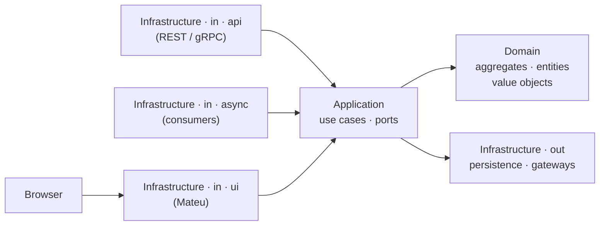
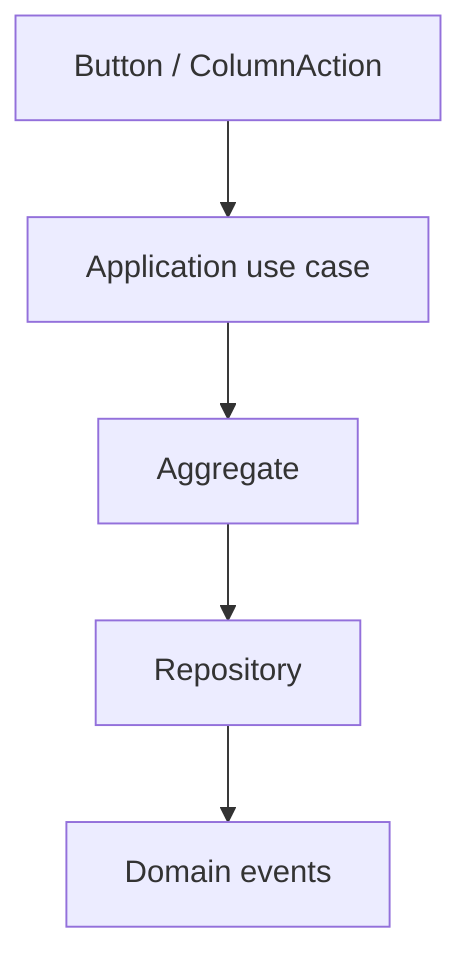
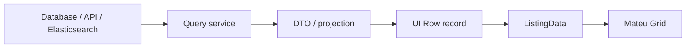

Mateu is an inbound adapter. It sits in `infrastructure/in/ui`, translating user gestures into application use case calls — exactly where a REST API or a message consumer would sit.

This is the key idea:

> The UI is just another inbound adapter.

Everything else follows from it.

---

## Where Mateu fits

A typical hexagonal system looks like this:

```text
Application
  ├─ use cases
  ├─ ports / interfaces
  │   ├─ queries
  │   ├─ repositories
  │   └─ gateways

Domain
  ├─ aggregates
  ├─ entities
  ├─ value objects
  └─ domain services

Infrastructure
  ├─ in
  │   ├─ api          ← REST / gRPC
  │   ├─ async        ← event consumers
  │   └─ ui           ← Mateu
  └─ out
      ├─ persistence
      └─ gateways
```

Mateu lives in `in/ui`. It adapts user interaction into application use cases and query calls, using the same ports as the REST API. It does not introduce a new architectural layer.



---

## Why this matters

In many systems, teams build REST APIs because the frontend needs them. With Mateu, that intermediate step is often unnecessary.

If the UI is an inbound adapter, it can call:
- application use cases
- query services
- repositories through ports
- gateways through ports

directly from the backend.

> If the UI is just another inbound adapter, you do not need to build an API only for your UI.

This removes duplicated contracts, duplicated models, and the glue code between them.

---

## CQRS fit

Mateu works naturally with CQRS. The write side uses DDD aggregates; the read side uses query services and DTOs.

### Write side

Buttons and column actions express intent. They call use cases, which delegate to aggregates:



Business rules stay in the domain:
- value object when possible
- aggregate when the rule spans multiple fields
- domain service only when the logic exceeds one aggregate

### Read side

Listings and forms use query services and DTOs directly. No domain entities needed on the read path:



See [Query services and UI rows](/java-user-manual/real-world/query-services-and-ui-rows/) for the full pattern.

---

## UI rows are read models

A listing row is a UI read model — a record designed for display, not persistence:

```java
public record ChangeRow(
        @Hidden String id,
        String page,
        String country,
        String language,
        Status status,
        ColumnAction action
) implements Identifiable {}
```

This is not a domain entity. It can contain formatted values, status badges, hidden ids, row actions, and derived fields. The domain entity never leaks into the UI.

---

## Actions call use cases

Action ids are a contract between the UI and the backend. The backend decides what happens:

```java
new ColumnAction("compare", "Compare")
```

```text
compare
  ↓
ComparePagesUseCase
  ↓
domain / query / workflow
```

This keeps all logic server-side. The frontend remains a thin renderer.

---

## Lookups use query services

Lookup fields on the read path also call query services:

```java
@Lookup(search = LabelOptionsSupplier.class, label = LabelLabelSupplier.class)
String labelId;
```

```text
LookupOptionsSupplier
        ↓
Query service
        ↓
DTOs
        ↓
Option
```

The ViewModel that uses `@Lookup` never sees the data source. See [Lookups backed by query services](/java-user-manual/real-world/lookups-backed-by-query-services/).

---

## Microservices

A good default boundary is one microservice per bounded context or subdomain — not one per technical component.

Each microservice can own:
- its domain model
- its database
- its use cases and query services
- its read models
- its Mateu UI module

Mateu then allows these UI modules to be composed into a distributed backoffice using `RemoteMenu`. See [Service-owned UI modules](/java-user-manual/real-world/service-owned-ui-modules/).

---

## Stateless UI

Mateu does not keep UI state on the server. Each request:

1. Instantiates the ViewModel
2. Hydrates it from the request payload
3. Executes the action
4. Returns the result

This fits naturally with ephemeral pods, horizontal scaling, and no sticky sessions.

---

## Database strategy

A common pattern:

```text
Write side
  → DDD aggregates → repositories → JPA / ORM

Read side
  → query services → JDBC / SQL / projections → DTOs / rows
```

For cross-service reads, use a read database populated by events from the relevant services.

---

## Events, outbox, and inbox

For reliable event-driven integration:
- use an outbox to publish events atomically with state changes
- use an inbox to prevent processing the same event twice

Mateu does not replace these patterns. It sits on top of them as an inbound UI adapter. Domain events flow through the normal infrastructure; Mateu only renders their effects.

---

## Value objects

A useful rule:

```text
Value Object
  → never null, always valid

Field
  → decides whether the value exists
```

The UI can expose optional fields. Once a value object is constructed, it must be valid. Validation at the boundary — not inside the aggregate.

---

## Mental model

```text
User
  ↓
Mateu UI adapter (infrastructure/in/ui)
  ↓
Application use cases / query services
  ↓
Domain / read models / gateways
```

Mateu is not a layer outside the architecture. It is part of it. This is why it works especially well for business UIs: it lets your backend architecture expose a UI directly, without a separate frontend application or a separate API layer built only to serve that frontend.

---

## Next

- [Service-owned UI modules](/java-user-manual/real-world/service-owned-ui-modules/) — how each microservice exposes and composes its UI
- [Query services and UI rows](/java-user-manual/real-world/query-services-and-ui-rows/) — the read-side pattern in detail
- [Security](/java-user-manual/advanced/security/) — JWT-based authorization as another inbound adapter concern
