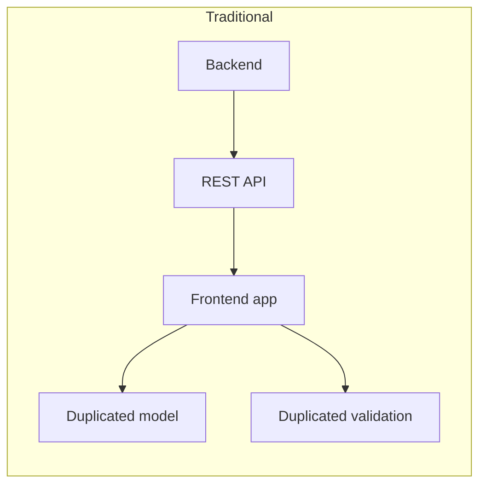
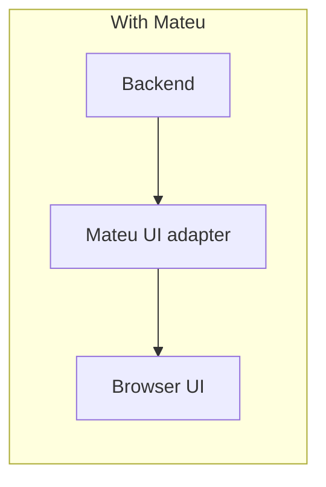

Mateu is designed to fit into serious backend architectures.

Its core architectural idea is:

> UI is an inbound adapter.

That means Mateu can live next to:

- REST controllers
- gRPC endpoints
- message consumers
- scheduled jobs

The difference is that Mateu exposes a browser UI instead of an API endpoint.

---

## Why this is powerful

Many internal tools are built like this:

Mateu allows this instead:

This reduces glue code while keeping architecture clean.

---

## Best fit

Mateu works especially well when your system uses:

- DDD
- CQRS
- hexagonal architecture
- microservices
- query services
- workflow engines
- event-driven integration

---

## Main principle

Keep logic in the center.

- validation and invariants belong in value objects and aggregates
- commands belong in use cases
- reads belong in query services
- UI belongs in an inbound adapter

Mateu gives that UI adapter a browser renderer.

---

## Read more

- [Mateu in hexagonal architecture](/java-user-manual/real-world/mateu-in-hexagonal-architecture/)
- [Distributed control plane case study](/java-user-manual/real-world/distributed-control-plane/)
