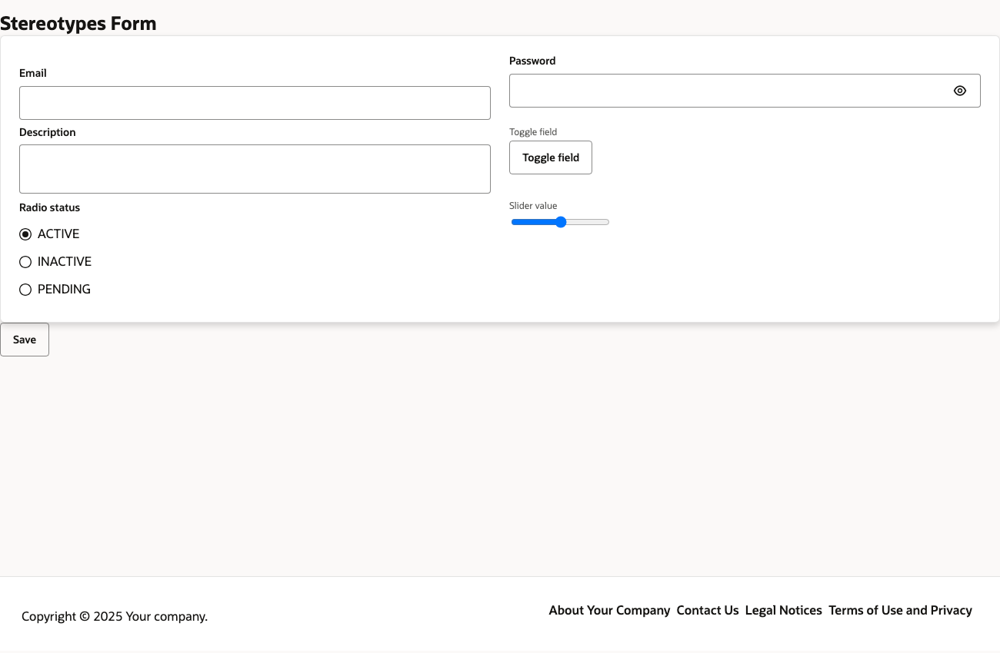
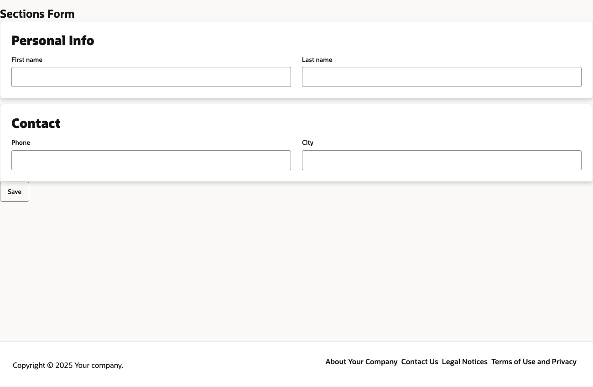
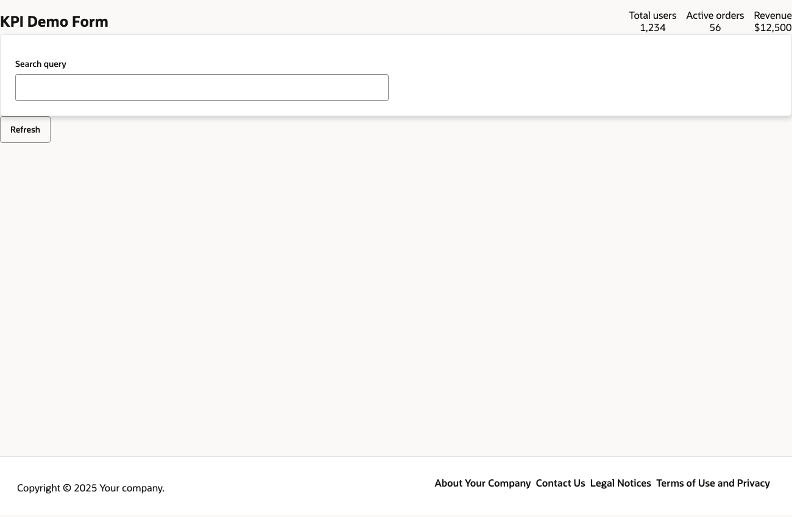
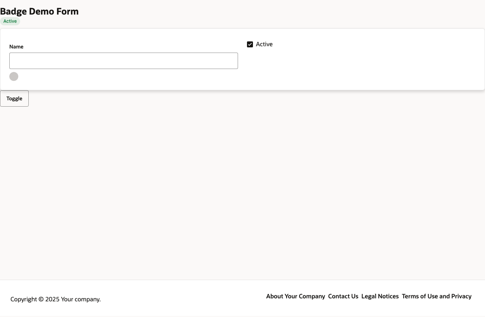

# Renderer conformance report — redwood-oj

- Base URL: http://localhost:5199
- Date: 2026-07-04T19:35:16.880Z
- Renderer info: name=`redwood-oj`, declared types: 60

## Parity matrix (types exercised by the fixtures)

| ComponentMetadataType | Declared supported | Placeholder observed |
|---|---|---|
| Badge | yes | no |
| Button | yes | no |
| Card | yes | no |
| Form | yes | no |
| FormField | yes | no |
| Page | yes | no |
| Text | yes | no |

## Fixtures

| Route | Status | Placeholders seen | Console errors | Screenshot |
|---|---|---|---|---|
| /stereotypes | rendered | — | 12 |  |
| /sections | rendered | — | 12 |  |
| /kpi | rendered | — | 12 |  |
| /badge-demo | rendered | — | 12 |  |
